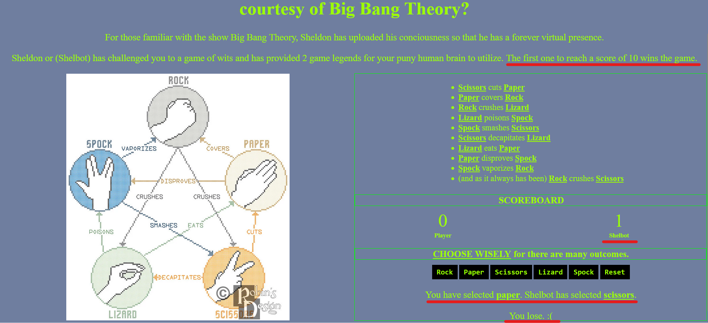
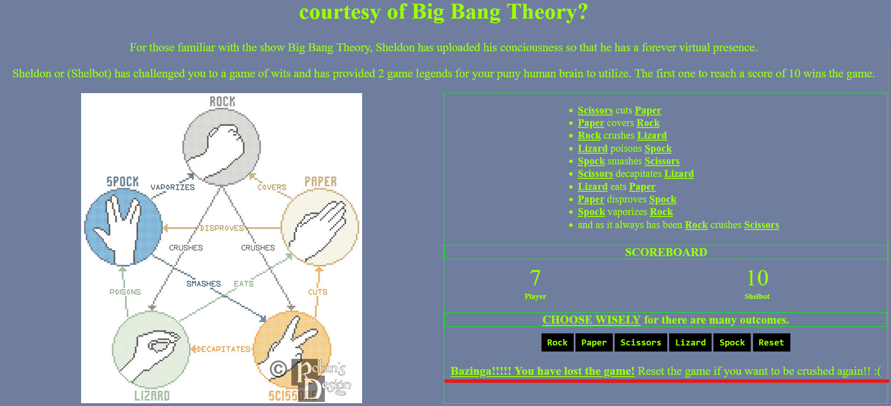
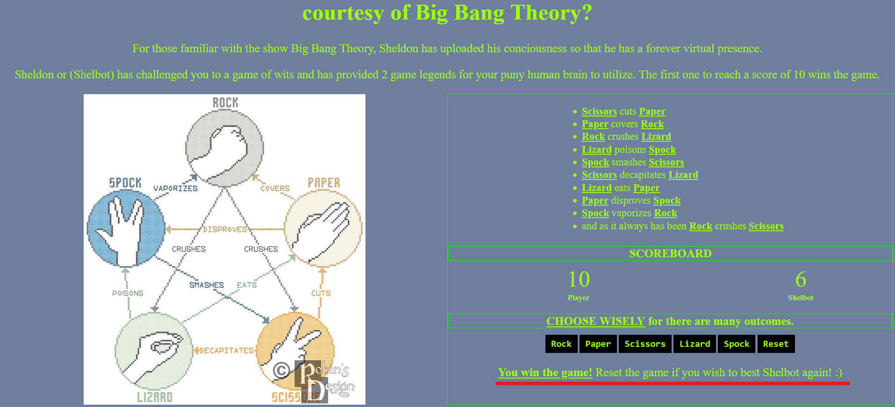
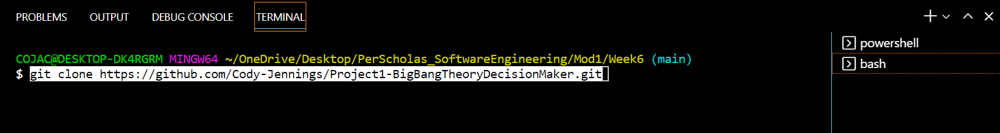
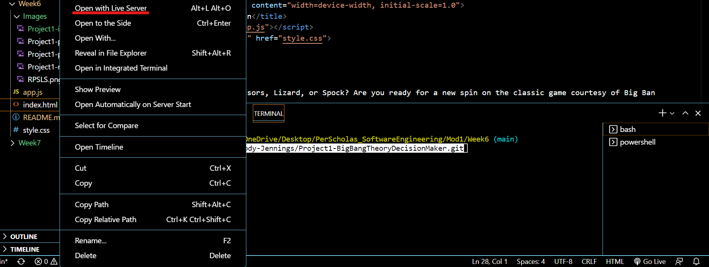
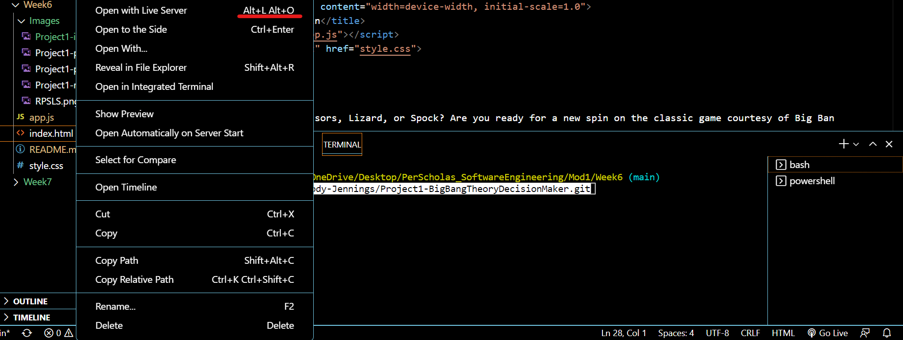
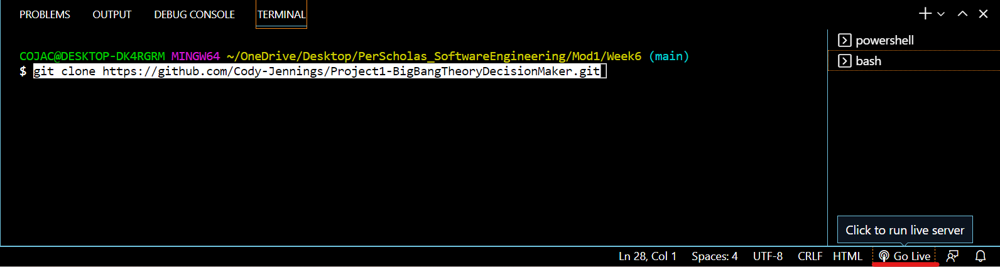

# Big Bang Theory Decision Maker

While the title may suggest otherwise this is simply an extended version of Rock, Paper, Scissors, with two added elements of Lizard and Spock. This game can be played amongst many people especially when making a final decision. Can be used to settle where to eat, what movie to watch, what direction to go etc.

- - - 

## Introduction

Rock, Paper, Scissors, Lizard, Spock, appeared in an episode of Big Bang Theory titled "The Lizard-Spock Expansion". Sheldon, one of the main characters of the show, gives a brief history and explains the new rules. As mentioned before this game can be played amongst multiple people. These individuals make their choices and display them simultaneously to prevent anyone from changing at the last second. The sign for Rock is a "closed fist", Scissors is a "horizontal peace sign", Paper is a "horizontal flat hand with plam facing down". Now comes the additions, Lizard is "all fingers meet thumb horizontally almost like making a set of jaws", and lastly is Spock which has three groupings of fingers "fingers and thumbs pointed to sky like a high five, thumb is by itself then a gap, then pointer and middle finger together then a gap, and lastly ring and pinky finger together. I have attached links for viewer pleasure to showcase where I got my motivation for this game from and the final game product. [Game Motivation](https://bigbangtheory.fandom.com/wiki/Rock,_Paper,_Scissors,_Lizard,_Spock) and 
[Live Site](https://cody-jennings.github.io/Project1-BigBangTheoryDecisionMaker/)

- - - 

## Game Play

In a normal game players can say Rock, Paper, Scissors, Lizard, Spock, then show their choice against the other players choice. In this project the player will get to select which of the five choices they would like (Rock, Paper, Scissors, Lizard, Spock) and upon selecting the preferred choice button the computer randomizes its choice amongst the exact same options.

Both player and computer choices are then calculated and displayed via text instantly, along with who won and an increase of one point on the scoreboard to whomever won. If there is a tie, the scores remain unchanged from the previous round. This round of play will continue until the overall game ends when someone reaches 10 first and has a special message displayed. In other words if the player is tied with the computer at 9-9 whoever wins the round to get to 10 wins the game! Players also have a choice to replay due to pressing their luck (if they won) or proving the computer's taunting wrong (for losing the game).

- - - 

## Rules:

I have included two legends to utilize while making your decision. One legend has visual symbols used in case my descriptions were hard to follow. Rock, Paper, Scissors, Lizard, Spock, adds additional elements and rules. Before Lizard and Spock were added there were only three rules to follow: 

- Scissors cuts Paper
- Paper covers Rock
- Rock crushes Scissors

Now with the additions of Lizard and Spock the rules go up to ten:

- Scissors cuts Paper
- Paper covers Rock
- Rock crushes Lizard
- Lizard poisons Spock
- Spock smashes Scissors
- Scissors decapitates Lizard
- Lizard eats Paper
- Paper disproves Spock
- Spock vaporizes Rock
- (and as it always has been) Rock crushes Scissors

- - -

## Game Play screenshots

Below is an outcome example of one round of play. This displays who chose what, who won the round and an updated score.

Below is the player lose state outcome with final score and computer taunting message.

Below is the player win state outcome with final score and computer taunting message.

- - - 

## Technologies used:
- HTML
- CSS
- JavaScript
- Deployed to Github pages directly from GitHub

- - - 

## Acknowledgements:
- Big Bang Thoery 
- Youtube tutorials
- MDN Web Docs
- W3 Schools
- GitHub Docs 
- Kasper Kain
- Richard Harris
- Long Hoang
- All other classmates who took time to look at my project and gave confidence boosters and feedback/criticism.

## How to access this Repository

1. Clone or fork the repository

To download the code, copy and paste the following into your terminal:
git clone https://github.com/Cody-Jennings/Project1-BigBangTheoryDecisionMaker.git

2. Using VSCode launch the index.html file with the live server extension, this can be accomplished three ways. 

First is to right click on the file and selecting Open with Live Server.

Second method is to use the shortcut Alt+L Alt+O

Third method is using the Go Live option in the bottom right hand corner of your terminal.

## Disclaimer

I am not affiliated with nor own any rights regarding this game or the tv show Big Bang Theory. No profits were generated from this project. All material utilized were for educational and demonstration purposes. 